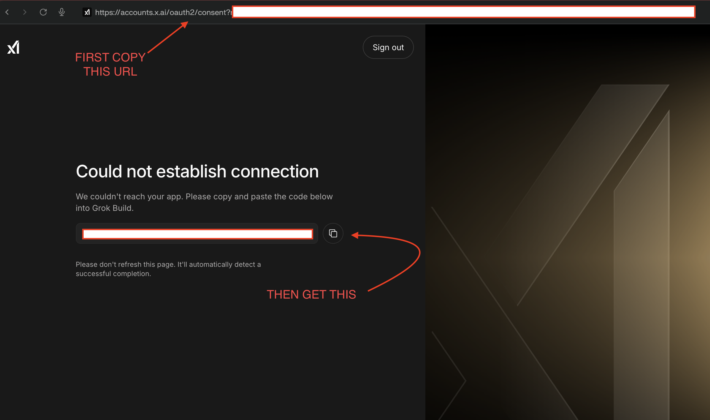

For some reason I kept getting kicked out of my XAI oauth in Hermes so here's a quick way to just get your info. 

After approving the oauth flow in your browser, your browser will try to load the callback url and will fail :(
Need not worry. Here's what you do:

Step 1: Copy the FULL URL from your browser's address bar of that failed page
Step 2: Copy the code XAi gives you

then this help will generate the bare '?code=...&state=...'
and then you can paste it your terminal directly
